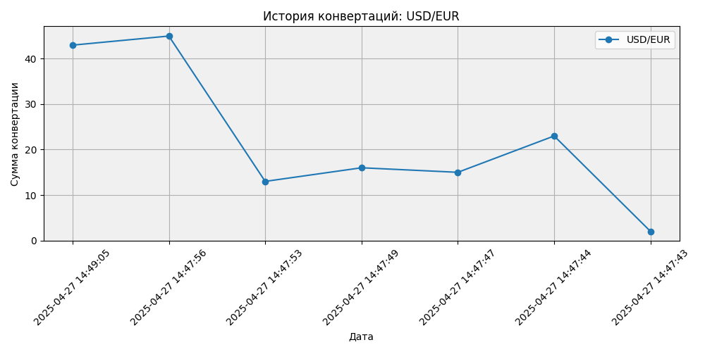

# 💱 ConvertMoney — Currency Exchange Application

[](https://python.org)
[](LICENSE)
[](#)

> 🇷🇺 Приложение для автоматизации работы пунктов обмена валют с поддержкой локальных особенностей Дагестана.

---

## 📋 Оглавление
- [О проекте](#-о-проекта)
- [Функционал](#-функционал)
- [Технологии](#-технологии)
- [Установка](#-установка)
- [Сборка в .exe](#-сборка-в-exe)
- [Использование](#-использование)
- [Структура проекта](#-структура-проекта)
- [Лицензия](#-лицензия)
- [Автор](#-автор)

---

## 🚀 О проекте

**ConvertMoney** — это десктопное приложение на Python для учета валютных операций, разработанное с учетом реальных потребностей обменных пунктов.

### ✨ Ключевые особенности:
- 🔐 **Авторизация пользователей** — разделение прав доступа
- 💱 **Конвертация валют** — актуальные курсы ЦБ РФ через API
- 📊 **Аналитика и графики** — визуализация транзакций в реальном времени
- 💾 **Локальное хранение** — SQLite база данных + резервное копирование в JSON
- 🌐 **Работа офлайн** — кэширование курсов при отсутствии интернета
- ⚙️ **Гибкие настройки** — адаптация под локальные особенности региона



---

## 🛠 Технологии

| Категория | Инструменты |
|-----------|-------------|
| Язык |  |
| GUI | CustomTkinter / Tkinter |
| База данных | SQLite |
| API запросы | Requests |
| Визуализация | Matplotlib |
| Сборка | PyInstaller |

---

## 📦 Установка

### 1. Клонирование репозитория
```bash
git clone https://github.com/MrDobryak88/ConvertMoney.git
cd ConvertMoney
